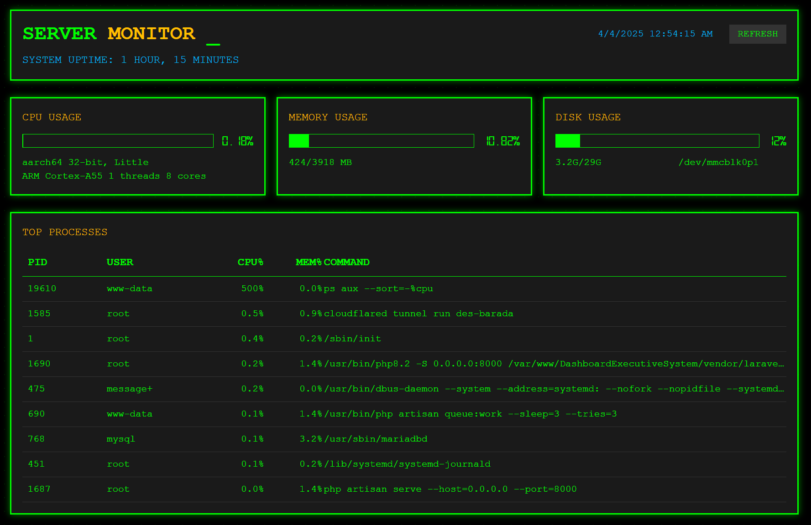

# Server Monitor

Sebuah dashboard monitoring server real-time dengan tampilan retro terminal yang menampilkan penggunaan CPU, memori, disk, dan proses yang sedang berjalan.

## Fitur

- **Monitoring Real-time**: Pembaruan otomatis setiap 5 detik
- **Ikhtisar Sistem**:
  - Penggunaan CPU dengan detail arsitektur
  - Konsumsi memori (terpakai/total)
  - Penggunaan ruang disk per perangkat
  - Uptime sistem
- **Pelacakan Proses**: 10 proses paling banyak menggunakan CPU
- **Antarmuka Retro**: Desain bergaya terminal dengan warna hijau-hitam

## Persyaratan

- PHP 7.0+
- Server Linux (diuji pada Ubuntu/Debian)
- Perintah shell dasar: `lscpu`, `free`, `df`, `uptime`, `ps`

## Instalasi

1. Unggah file PHP ke server web Anda (misalnya `server.php`)
2. Pastikan server web memiliki izin untuk menjalankan perintah shell
3. Akses halaman melalui browser web

## Catatan Keamanan

⚠️ **Penting**: Skrip ini menjalankan perintah shell dan harus diamankan dengan baik:

1. Batasi akses melalui whitelist IP atau autentikasi
2. Pertimbangkan untuk menghapus atau mengomentari header `Access-Control-Allow-Origin` di produksi
3. Jalankan server web dengan hak istimewa minimal
4. Idealnya, pasang di balik reverse proxy dengan HTTPS

## Kustomisasi

### Penyesuaian UI
Ubah konfigurasi Tailwind di bagian `<script>` untuk mengubah:
- Warna (palet `retro`)
- Font (default: Courier New dan Digital-7)
- Efek glow dan animasi

### Pengumpulan Data
Edit fungsi PHP untuk:
- Menambahkan lebih banyak metrik sistem
- Mengubah interval pembaruan (saat ini 5 detik)
- Memodifikasi jumlah proses yang ditampilkan (saat ini 10 teratas)

## Screenshot

## Lisensi

Lisensi MIT - Gratis untuk penggunaan pribadi dan komersial